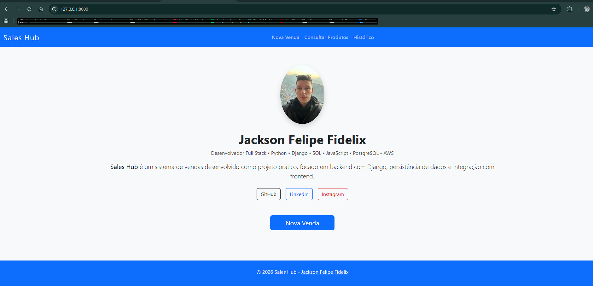
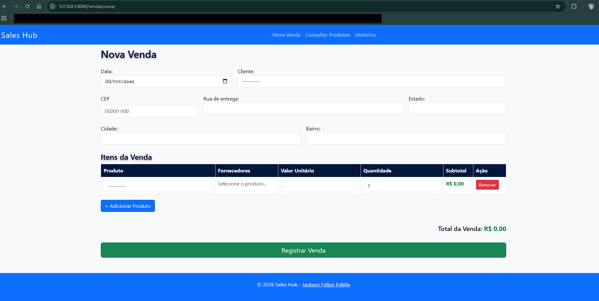
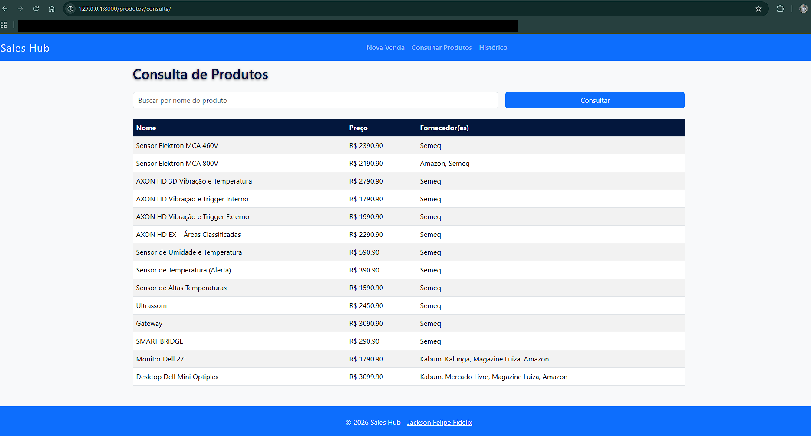
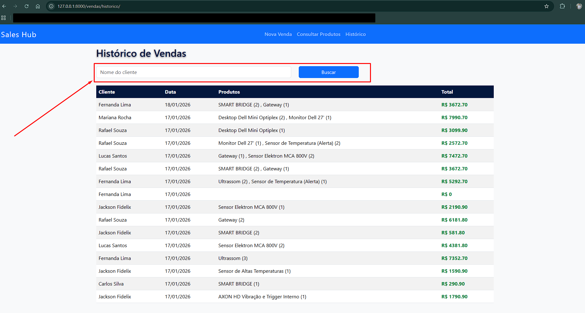

# Sales Hub

Sistema de gerenciamento de vendas, desenvolvido para fins de avaliação técnica.  

Projeto full-stack focado em registrar vendas com regras de negócio específicas, integração com API ViaCEP, busca de produtos e exibição dinâmica de itens/fornecedores.

## Funcionalidades Implementadas (Core do Desafio)

- Registro de vendas com campos obrigatórios:
  - Data da venda
  - Endereço de entrega completo (auto-preenchido via CEP)
  - Um ou mais produtos
  - Comprador
- Tela de venda com tabela dinâmica:
  - Adicionar/remover produtos
  - Exibição de nome, valor unitário e fornecedor(es)
  - Cálculo automático de subtotal
- Busca de produtos por nome na tela de consulta
- Consulta de CEP com preenchimento automático (rua, bairro, cidade, estado)
- Uma venda pode ter múltiplos produtos e múltiplos fornecedores por produto
- O cliente consegue ver seu histórico de compra

---

## Tecnologias Utilizadas

- **Backend**: Python 3 + Django
- **Frontend**: HTML, CSS, JavaScript + Bootstrap 5
- **Banco de Dados**: PostgreSQL
- **Integração Externa**: [ViaCEP](https://viacep.com.br/) (consulta automática de endereço por CEP)

### Plus Implementados

- Sistema responsivo (Bootstrap)
- Validações de campo para se realizar uma venda (frontend + backend)

## 🛠️ Passo a passo para rodar o projeto

### 1. Clone o repositório
   git clone https://github.com/jackson-fidelix/sales-hub.git
   cd sales-hub

### 2. Crie e ative o ambiente virtual
  python -m venv venv

### 3. Instale as dependências
  pip install -r requirements.txt

### 4. Configure o PostgreSQL
- Crie um banco de dados no PostgreSQL:
- Nome: sales_hub_db (ou o nome que você preferir)
- Usuário: seu_usuario
- Senha: sua_senha

###  5.Em seguida, ajuste o settings.py do core. Ex:
 ```python
DATABASES = {
    'default': {
        'ENGINE': 'django.db.backends.postgresql',
        'NAME': 'sales_hub_db',
        'USER': 'postgres',
        'PASSWORD': 'Postgre2026#',
        'HOST': 'localhost',
        'PORT': '5432',
    }
}
```
### 6. Rode as migrations
  python manage.py makemigrations (nome do seu app)
  python manage.py migrate

### 7. Criar superuser (admin)
- Com isso voce pode acessar a tela admin do sistema. Comando:
  python manage.py createsuperuser

---

🚦 Como usar o sistema:

### 1. Rodar o servidor
  python manage.py runserver
- Acesse no navegador:
  http://127.0.0.1:8000/
  
- Você verá essa tela:


### 2. Registrar uma venda
- Clique em "Nova Venda".
- Você verá essa tela:


- Adicione cliente e produtos
- Clique em Registrar Venda
- Confirme que a venda foi salva no Admin

### 3. Verificar no Admin
  http://localhost:8000/admin

- Verifique:
- Sale
- SaleItem
- Product

### 4. Consultar Produtos
- Acesse Consultar Produtos
- Teste a busca por nome

- Você verá essa tela:


### 5. Histórico de vendas
- Acesse Histórico
- Teste filtro por cliente
- Confira se mostra os produtos da venda

- Você verá essa tela:


---

📌 Rotas do Projeto
| Página             | URL                   | Descrição                       |
| ------------------ | --------------------- | ------------------------------- |
| Home               | `/`                   | Página inicial                  |
| Nova Venda         | `/vendas/nova/`       | Formulário para registrar venda |
| Consultar Produtos | `/produtos/consulta/` | Lista e busca de produtos       |
| Histórico          | `/vendas/historico/`  | Histórico de vendas por cliente |
| Admin              | `/admin/`             | Dashboard administrativo        |

---

📌 Contato
- GitHub: https://github.com/jackson-fidelix/
- LinkedIn: https://www.linkedin.com/in/jacksonfidelix/
- Instagram: https://www.instagram.com/_jacksonfidelix/
- Autor: Jackson Felipe Fidelix